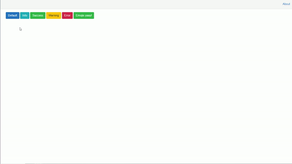

# BlazorToastify
BlazorTostify is an open source AND javascript-free toast notification package for Blazor Framework.



## Table of contents
1. [Getting started & Installation](#1-Getting-Started-&-Installation)
2. [Usage](#2-Usage)
3. [Documentation](#3-Documentation)

## 1. Getting Started & Installation
[Link to package](https://www.nuget.org/packages/BlazorToastify/)
Install the package via NuGet Manager search or BlazorTostaify. You can also use powershell to install the package using following command.

```powershell
Install-Package BlazorToastify
```
Or use the dotnet CLI.

```bash
dotnet add package BlazorToastify
```

### 1.1 Register the services
In order to use BlazorToastify service you will need to register it in `Startup.ConfigureService` method.

```csharp
public void ConfigureServices(IServiceCollection services)
{
    services.AddToasts();
}
```

### 1.2 Add import
Add the following using statement to your `_Imports.razor` file.

```csharp
@using BlazorToastify
```

### 1.3 Add toast container to your layout
Add `<ToastContainer />` tag in your razor layout. For example: `MainLayout.razor`.

### 1.4 Add reference to CSS stylesheet
Add the following line at the END of your `head` tag to your `_Host.cshtml` (Blazor Server App) or `index.html` (Blazor WebAssembly).

```html
<link href="_content/BlazorToastify/blazor-toastify-style.css" rel="stylesheet" />
```

## 2. Usage
If you want to show a toast you need to inject `IToastService` into the component/code where you want to trigger a toast. After injecting the service you can call the following method to trigger a toast.

```csharp
await ToastService.AddToastAsync(
    message: "Hello I am a success toast!",
    type: "success",
    animation: "fade",
    autoClose: 5000
);
```

```html
@page "/"
@inject IToastService ToastService;

<button class="btn btn-primary" @onclick="@(async () => await ToastService.AddToastAsync("Default Toast"))">Default</button>
<button class="btn btn-info" @onclick="@(async () => await ToastService.AddToastAsync("Info toast", "info", "fade"))">Info</button>
<button class="btn btn-success" @onclick="@(async () => await ToastService.AddToastAsync("Success Toast", "success"))">Success</button>
<button class="btn btn-warning" @onclick="@(async () => await ToastService.AddToastAsync("Warning Toast", "warning"))">Warning</button>
<button class="btn btn-danger" @onclick="@(async () => await ToastService.AddToastAsync("error Toast", "error", "bounce", 10000))">Error</button>
```

Examples are included in [samples](https://github.com/AljazOblonsek/BlazorToastify/tree/master/samples) folder.

## 3. Documentation

### 3.1 AddToastAsync
Method is awaitable, it adds a toast in toast container.
* Parameters
    * `message`: string, required // Message you want to display on the toast notification
    * `type`: string, not required - options: default, info, success, warning, error // Type of the toast notification
    * `animation`: string, not required - options: bounce, fade // Animation the toast notification will use
    * `autoClose`: int, not required - // Time for toast to be visible in MS